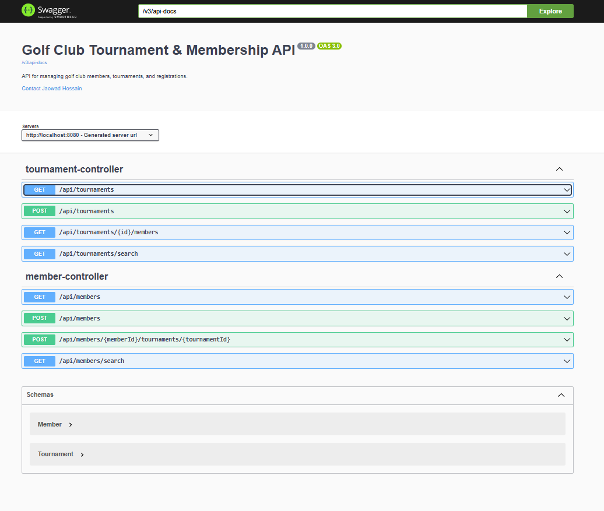
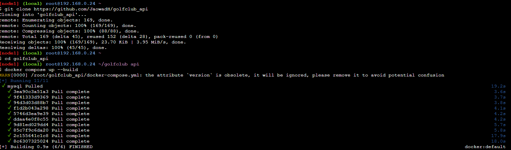

# Golf Club Tournament & Membership API

A RESTful Spring Boot API for managing golf club members, tournaments, and registrations.

## Features

- Member registration and search
- Tournament creation and search
- Member-tournament participation tracking
- API documentation via Swagger UI
- Dockerized for easy deployment
- CI/CD pipeline via GitHub Actions

---

## 🔍 API Documentation

The API is documented using SpringDoc OpenAPI and available at:

http://localhost:8080/swagger-ui/index.html


### Sample Swagger Screenshot:



---

## 🔍 Search API Endpoints

| Method | Endpoint                                 | Description                             |
|--------|------------------------------------------|-----------------------------------------|
| GET    | `/api/members/search?name=John`          | Search members by name (partial match)  |
| GET    | `/api/tournaments/search?location=NYC`   | Search tournaments by location          |

---

## 🚀 Running with Docker

To run the application in a Docker container:

### 1. Prerequisites

- Docker and Docker Compose installed
- Port `3306` (MySQL) and `8080` (API) available

### 2. Start the Application

```bash
docker-compose up --build

```
### 3. Verify Running Containers

```bash
docker ps

```
### Sample Docker Terminal Screenshot:



## 🧪 GitHub Actions CI
 - CI/CD pipeline includes:
 - Maven build
 - JDK 21 setup
 - mDocker Compose startup
 - Logs and container verification


